# 操作系统结构

## 用户态与内核态

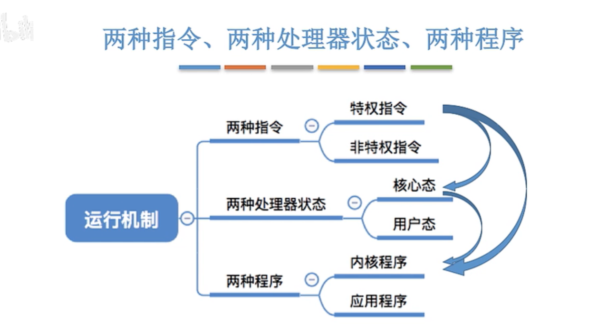

**特权指令**指具有特殊权限的指令。这类指令只用于操作系统或其他系统软件，一般不直接提供给用户使用。

计算机中有一些比较危险的操作，比如设置时钟、内存清理，如果随意进行危险操作，极容易导致系统崩坏。所以需要区分**特权指令**和**非特权指令**，防止用户进行危险操作。当执行特权指令的时候，计算机会进入内核态，操作由操作系统内核接管。


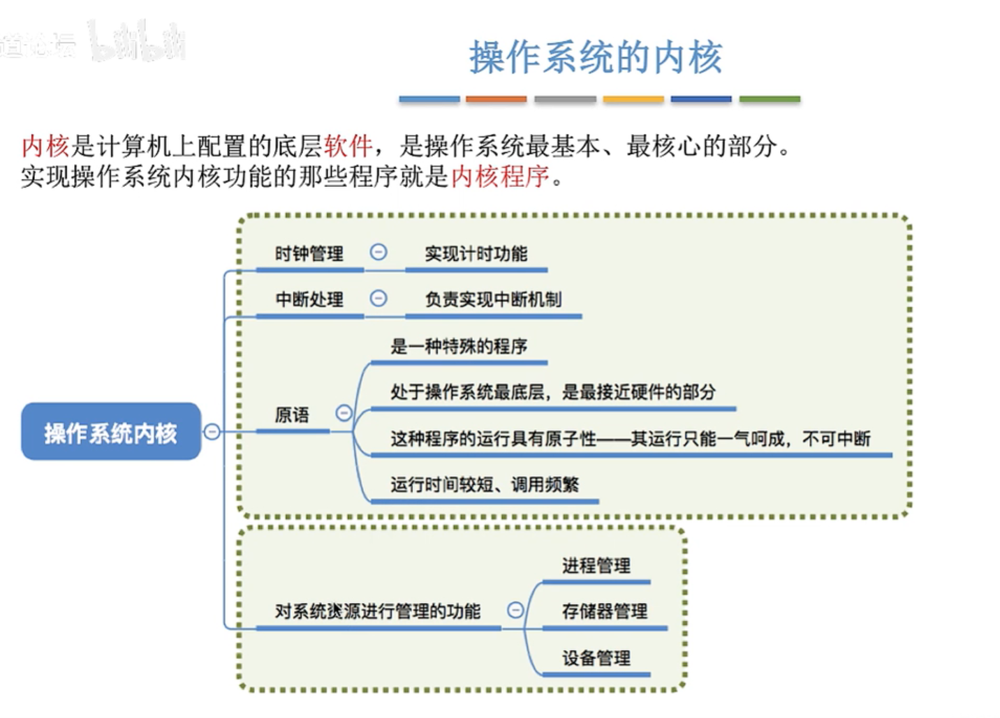

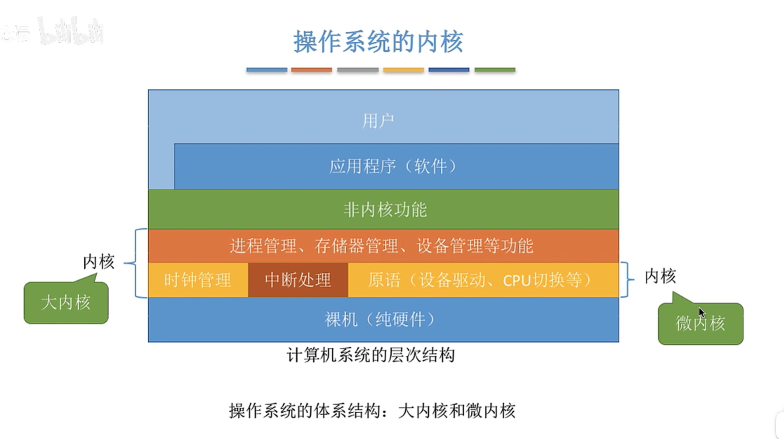

大内核：将操作系统的主要功能模块作为系统内核

- 优点：高性能
- 缺点：内核代码大，结构混乱，难以维护

微内核：只把最基本的功能保留在内核

- 优点：内核功能少，结构清晰，方便维护
- 缺点：需要频繁的在核心态和用户态之间切换，性能低


------------------------------------------------------------------------------------------------------------------------------------------------------------------------------------

## 中断与异常

发生中断就意味着需要操作系统介入，开展管理工作。由于操作系统的管理工作(比如进程切换、分配 I/O 设备)需要使用特权指令，因此CPU需要从用户态转化为核心态。中断可以使CPU从用户态切换为核心态，使操作系统获得计算机的控制权。有了中断，才能实现多道程序并发执行。

**用户态切换到核心态有且仅由中断实现。**

**核心态切换到用户态是通过执行一个特权指令，将程序状态字(PSW)的标志位设置为用户态。**

1. 当中断发生时，CPU立即进入核心态

2. 当中断发生后，当前运行的进程暂停运行，并由操作系统对中断进行处理

3. 对于不同的中断信号，会进行不同的处理。

   

### 中断的分类

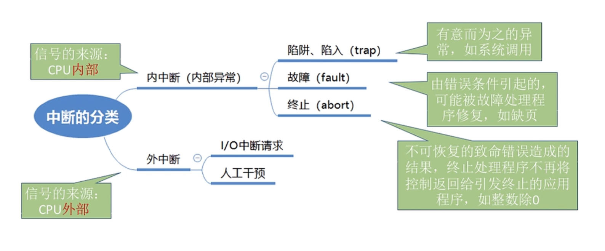

**内中断：**信号来源于CPU内部，与当前执行的指令有关

**外中断：**信号来源于CPU外部，与当前执行的指令无关

------

# 进程

$$
进程
\begin{cases}
定义:进程是 \pmb{进程实体} 的运行过程，是系统进行资源分配和调度的一个独立单位。(系统资源分配的最小单位)

\\\\组成
	\begin{cases}
	PCB
		\begin{cases}
		进程ID\\
		程序计数器\\
		进程状态\\
		优先级\\
		通用寄存器: 存储进程运行时产生的数据\\
		打开的文件清单\\
		打开的设备清单\\
		\end{cases}
	\\程序段: 存放要执行的程序代码
	\\数据段: 存放程序运行过程中处理的各种数据
	\end{cases}

\\\\组织形式
	\begin{cases}
	链接方式: 按进程状态将PCB分为多个队列\\
	索引方式: 按进程状态建立几张索引表，各表项指向一个PCB\\
	\end{cases}

\\\\特征
	\begin{cases}
	动态性: 进程是一个动态的概念\\
	并发性\\
	独立性: 进程是系统进行资源分配，调度的独立单位\\
	异步性: 各进程以不可预知的速度向前推进，可能导致运行结果的不确定性\\
	结构性\\
	\end{cases}
\end{cases}
$$

------

## 进程的状态与切换

### 进程五状态模型


1. 创建态: 进程正在被创建，操作系统为进程分配资源，初始化PCB

2. 就绪态: 可运行，但因为其他进程正在运行而暂时停止

3. 运行态: 该时刻实际占用CPU

4. 阻塞态: 除非某种外部事件发生，否则不能运行

5. 终止态: 进程从系统中撤销，操作系统回收进程拥有的资源，撤销PCB

   

### 进程七状态模型


在内存空间紧张的时候，系统将内存中的某些进程暂时换到外存。把外存中某些已经具备运行条件的进程换到内存中。(进程在内存和磁盘间动态的调度 **PCB会常驻内存，不会交换到磁盘**)。这种情况下，最好的选择就是将阻塞的进程或者优先级低的进程交换到外存来。

------

## 进程通信

#### 共享存储

两个进程对共享空间的访问必须是互斥的。操作系统只负责提供共享空间和互斥工具。

- 基于数据结构的共享：比如共享空间内放一个数组，这种共享方式速度慢，是一种低级通信方式

- 基于存储区的共享：在内存中划出一块共享存储区，数据的形式、存放位置都由进程控制，而不是操作系统。相比之下这种共享方式速度更快，是一种高级通信方式

  

#### 管道通信


“管道”是用于连接读写进程的一个共享文件，其实就是在内存中开辟一个固定大小的缓冲区。

- 管道只能采用**半双工通信**，同一时间段内只能实现单向的传输。如果要实现双向同时通信，则需要设置两个管道。

- 各进程要**互斥的访问**管道。

- 数据以字符流的形式写入管道，当**管道写满的时候**，写进程的write()系统调用将被阻塞，等待读进程将数据取走。当读进程将数据全部取走之后，**管道变为空**，此时读进程的read()系统调用将被阻塞。

- 如果**没写满**，就**不允许读**。如果**没空**，就**不允许写**。

- 数据一旦被读出，就从管道中被抛弃，这就意味着**读进程**最多**只有一个**。

  

#### 消息传递

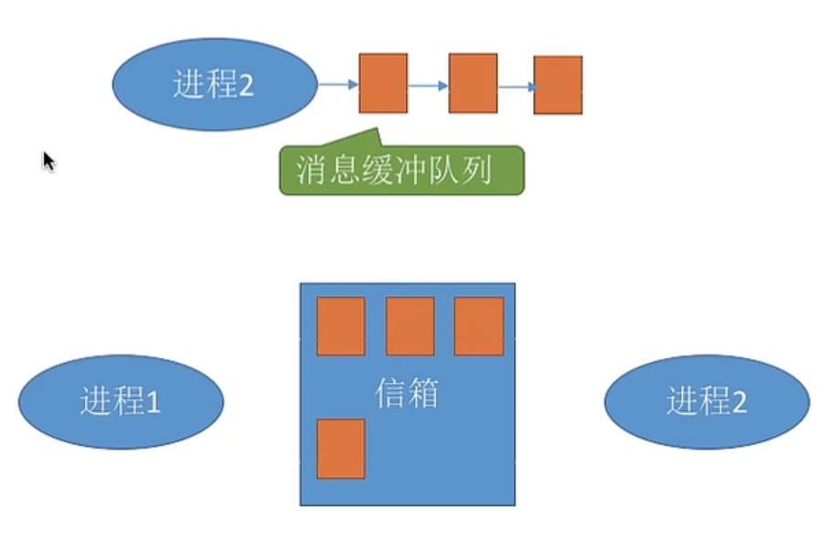

进程间的数据交换以格式化的信息为单位。进程通过操作系统提供的 “收/发消息” 两个原语进行数据交换。

- 直接通信方式：消息直接挂到接收进程的消息缓冲队列上
- 间接通信方式：消息先发送到中间实体（信箱）中，因此也称“信箱通信方式”。

------

## 进程调度

### 进程调度的层级


### 进程调度算法

**CPU利用率：**CPU处于忙碌的时间 / 总时间
**系统吞吐量：**作业完成量 / 总时间
**等待时间：**作业处于等待处理机状态时间之和（等待I/O时间不算，因为此时I/O设备在为作业服务）
**响应时间：**从用户提交请求到首次产生响应所用的时间
**周转时间：**作业完成时间 - 作业开始时间
**带权周转时间：**（作业完成时间 - 作业开始时间）/ 作业实际运行时间

------

#### 批处理系统

批处理系统没有太多的用户操作，在该系统中，调度算法目标是保证吞吐量和周转时间（从提交到终止的时间）。

##### 先来先服务(FCFS)

- **算法思想：**根据作业到达的先后顺序进行服务
- **优点：**公平，算法实现简单
- **缺点：**排在长作业后面的短作业，带权周转时间很长
- **是否导饥饿：**（某作业长期得不到服务）：否
- **是否抢占：**否

##### 最短作业优先(SJF)

- **算法思想：**优先服务最短的作业
- **优点：**平均等待时间、平均周转时间、平均带权周转时间都比先来先服务算法低
- **缺点：**长作业可能需要等待很久；并且作业运行时间是由用户提供的，不一定能做到真正的短作业优先
- **是否导饥饿：**是
- **是否抢占：**一般是非抢占式的，也可以是抢占式的。

##### 最高响应比优先(HRRN)

- **算法思想：**优先选择响应比高的作业得到服务（响应比 = （等待时间+要求服务时间) / 服务时间）
- **优点：**综合考虑了等待时间和运行时间
- **缺点：**
- **是否导饥饿：**否
- **是否抢占：**否

------

#### 交互式系统

交互式系统有大量的用户交互操作，在该系统中调度算法的目标是快速地进行响应。

##### 时间片轮转算法(RR)

- **算法思想：**按照各个作业到达就绪队列的顺序，轮流为各个作业服务一个时间片
- **优点：**公平，响应快
- **缺点：**如果时间片太大，会退化成先来先服务算法；如果时间片太小，系统会花费大部分时间处理进程切换（保存、恢复运行环境）。
- **是否导饥饿：**否
- **是否抢占：**是

##### 优先级调度算法

- **算法思想：**优先服务优先级高的作业
- **优点：**用优先级区分作业紧急程度。可灵活的调整优先级（比如让等待很久的进程优先级提高）
- **缺点：**低优先级作业可能会等待很久
- **是否导饥饿：**是
- **是否抢占：**既可以抢占，也可以不抢占

##### 多级反馈队列调度算法

- **算法思想：**
  1. 设置多级就绪队列，各级队列优先级由高到底，时间片从小到大
  2. 新进程到达时首先会进入一级队列，按先来先服务算法排队等待被分配时间片。若时间片用完还未结束，则进入下一级队列队尾。如果此时已经在最下级队列，则重新放入该队队尾
  3. 只有第K级队列为空时，才会为K+1级队列队头分配时间片
- **优点：**对各类型进程公平，每个新到达的进程都可以很快的得到响应，短进程只用较小的时间就可以完成
- **缺点：**
- **是否导饥饿：**是
- **是否抢占：**是

------

## 进程同步与互斥

### 进程互斥遵循的原则

1. **空闲让进：**临界区空闲时，可以允许一个请求进入临界区的进程立即进入临界区。
2. **忙则等待：**当已有进程进入临界区时，其他试图进入临界区的进程必须等待。
3. **有限等待：**对请求访问的进程，应保证能在有限时间内进入临界区。
4. **让权等待：**当进程不能进入临界区时，应立即释放处理器，防止进程忙等待。

### 进程互斥实现

1. **进入区：**检查是否可以进入临界区,若可以则设置正在访问临界区的标志(加锁),以阻止其他进程同时进入临界区
2. **临界区：**进程中访问临界资源的那段代码
3. **退出区：**解除正在访问临界资源的标志(解锁)
4. **剩余区：**处理代码的其余部分

```java
do{
    enter section;
    critical section;
    exit section;
    remainder section;
}while(true);
```

------

### 软件实现

#### 单标识法

**算法思想：**进程在访问完临界区后，会把临界区的使用权限移交给另一个进程。也就是说，每个进程进入临界区的权限只能由另一个进程赋予。

**算法实现：**turn的值刚开始为0，只允许进程号为0的进程进入临界区。若别的进程想要进入临界区，则会一直卡在循环外面，直到时间片用完发生调度。在0号进程访问临界区区间，即使切换到别的进程，也依然会被循环判断条件卡住。只有访问完临界区，将权限移交给下一个进程，下一个进程才能进入临界区。

```java
//假设有两个进程P0和P1
int turn = 0;      //turn表示当前允许进入临界区的进程号
void p0(){
    while(turn != 0);  //不是0号进程就会一直忙等待，直到时间片耗完为止
	critical section;
	turn = 1;          //移交权限给下一允许允许进入临界区的进程
	remainder section;
}

void p1(){
    while(turn != 1);       //进入区
	critical section;       //临界区
	turn = 0;               //退出区
	remainder section;      //剩余区
}
```

**局限性：**违背**空闲让进**原则，即使临界区是空闲的，开始时进程1也无法进入临界区


#### 双标志先检查

**算法思想：**设置一个bool类型数组用来标记各个进程是否在临界区中。每个进程在进入临界区之前先检查当前有无别的进程在临界区中。如果没有，则将自身对应的标志改为true，之后访问临界区。

**算法实现：**

```java
//假设有两个进程P0和P1
bool flag = new flage[2]{false, false}; //表示进入临界区的数组

void p0(){
    while(flag[1]); //如果没有别的进程在临界区中，则进入临界区
	flag[0] = true; //标记自己进入临界区
	cirtical section;
	flag[0] = false; //标记自己出临界区
	remainder section;
}

void p1(){
    while(flag[0])      //进入区
	flag[1] = true;     //进入区
	cirtical section;   //临界区
	flag[1] = false;    //退出区
	remainder section;  //剩余区
}
```

**局限性：**

如果按照 while(flag[1]) → while(flag[0]) → flag[0] = true → flag[1] = true的执行顺序，P0和P1会同时访问临界区。违反了**忙则等待**原则。
问题在于**“检查”**和**“上锁”**这两个步骤不是原子操作，**“检查”**后，**“上锁”**前可能发生进程的切换。


#### 双标志后检查

**算法思想：**双标志先检查法的问题在于先“检查”后“上锁”，但是这两个操作不是原子操作，导致两个进程能够同时进去临界区。所以这次先“上锁”后“检查”，来避免上述问题。

**算法实现：**

```java
//假设有两个进程P0和P1
bool flag = new flage[2]{false, false}; //表示进入临界区的数组

void p0(){
    flag[0] = true;  //标记自己进入临界区
	while(flag[1]);  //如果没有别的进程在临界区中，则进入临界区
	cirtical section;
	flag[0] = false; //标记自己出临界区
	remainder section;
}

void p1(){
    flag[1] = true;     //进入区
	while(flag[0]);     //进入区
	cirtical section;   //临界区
	flag[1] = false;    //退出区
	remainder section;  //剩余区
}
```

**局限性：**若按照 flag[0] = true → flag[1] = true → while(flag[0]) → while(flag[1])顺序执行，P0和P1都无法进入临界区。违背了“空闲让进”和“有限等待”的原则。


#### Peterson算法

**算法思想：**双标志后检查算法中，两个进程都争着进入临界区，但是谁也不让谁，导致最后都进入不了临界区。所以Peterson算法中，如果两个进程都争着进入临界区，则主动让对方先使用临界区。

**算法实现：**

```java
//假设有两个进程P0和P1
bool flag = new flage[2]{false, false}; //表示进入临界区的数组
int turn = 0; //表示优先让哪个进程进入临界区

void p0(){
    flag[0] = true; //标记自己进入临界区
	turn = 1; //优先让1号进程进入临界区
	while(flag[1] && turn==1); 
	cirtical section;
	flag[0] = false; //标记自己出临界区
	remainder section;
}

void p1(){
    flag[1] = true;             //进入区
	turn = 0;                   //进入区
	while(flag[0] && turn ==0)  //进入区
	cirtical section;           //临界区
	flag[1] = false;            //退出区
	remainder section;          //剩余区
}
```

**分析：**

在临界区空闲的情况下，也就是flag[i] = false，可直接进入临界区。

在同时到达临界区的情况下，两个flag一定都为true。这时候，是否能进入取决于判断语句前执行了哪个turn

- flag[0] = true → flag[1] = true → turn = 1 (?) → turn = 0 (?)

执行turn = 1，则P0被阻塞，礼让给P1；执行turn = 0，则P1被阻塞，礼让给P0。

**局限性：**未遵循让权等待原则，暂时无法进入临界区的进程会一直忙等待。

------

### 硬件实现

#### 中断屏蔽

利用”开中断/关中断“指令实现，当某进程开始访问临界区到访问结束为止都不允许被中断，也就不能发生进程切换，因此也不可能发生两个进程同时访问临界区的情况。

关中断；
访问临界区；
开中断；

**优点：**简单高效

**缺点：**不适用于多处理机（中断指令只对当前处理机有效果）。只适用于操作系统内核，不适用于用户进程（”开中断/关中断“指令只能运行在内核态）。


#### Test And Set指令

```c
//TS指令是用硬件完成的，执行的过程中不允许被中断
//无论是否被上锁，都会上锁，然后返回原来的状态
bool testAndSet(bool *isLock){
    bool old = *isLock;
    *isLock = true;
    return old;
}

while(testAndSet(&isLock)); //若开始时isLock,则会一直等待下去。若刚开始时没有上锁，则进入临界区并上锁。
cirtical section;
lock = false;
remaining section;
```

**优点：**实现简单，适用于多处理机环境

**缺点：**不满足让权等待原则，暂时无法进入临界区的进程会一直忙等待。


#### Swap指令

```c
//Swap指令是用硬件完成的，执行的过程中不允许被中断
//交换两个变量的值
void swap(bool *p1, bool *p2){
    bool temp = *p1;
    *p1 = *p2;
    *p2 = temp;
}

bool old = true;
while(old == true){ //若开始时isLock，则会一直等待下去。若开始时没有上锁，则进入临界区并上锁。
    swap(&old, &isLock);
}
cirtical section;
lock = false;
remaining section;
```

**优缺点和Test And Set指令一样**

------

### 信号量机制

用户进程可以通过使用操作系统提供的一对原语来对信号量进行操作。

**信号量：**一个变量(可以是一个整数，也可以是更复杂的记录型变量)，可以用一个信号量来表示操作系统中某种资源的数量。

**原语：**是一种特殊的程序段，其执行只能一气呵成，不可被中断。原语是由开中断/关中断指令实现的。

**P操作（wait）：**申请一个单位资源，进程进入
**V操作（signal）：**释放一个单位资源，进程出来、

------

#### 信号量实现逻辑

```java
Semaphore s = 1; //信号量s表示资源的数量

void wait(Semaphore s){ //wait原语，相当于“进入区”
    while(s<1); //如果资源不够则循环等待
    s = s-1; //如果资源足够，则占用一个资源
}

void signal(Semaphore s){ //signal原语，相当于“退出区”
    s = s+1; //使用完资源后，在退出区释放资源
}

void p0(){
    wait(s);             //进入区，申请资源
    critical section;    //临界区，使用资源
    signal(s);           //退出区，释放资源
}
```

缺点：没有满足让权等待原则


```java
class Semaphore{
    int value = 10;    //剩余资源数
    List<process> l;  //等待队列
}

void wait(Semaphore s){
    s.value--;
    if(s.value < 0){ //证明系统已经没有资源了
        block(s.l) //使用block原语使当前进程从运行态进入阻塞态，并挂到s的阻塞队列当中
    }
}

void signal(Semaphore s){
    //Math.abs(s.value) = 等待队列中进程的数量
    s.value++;
    //释放资源后，如果s.value <= 0则证明还有别的进程在等待资源
    if(s.value <= 0){ 
        wakeUp(s.l); //wakeUp原语唤醒阻塞队列中的一个进程，使改进程变为就绪态。
    }
}
```

因为在资源不够的时候会主动地将自己阻塞让出处理机，所以该机制遵循了让权等待的原则，不会出现忙等待现象。

------

#### 信号量实现进程互斥

```java
Semaphore mutex = 1; //临界区

void p0(){
    P(s);               //进入区，申请资源
    critical section;   //临界区，使用资源
    V(s);               //退出区，释放资源
}

void p2(){
    P(s);               //进入区，申请资源
    critical section;   //临界区，使用资源
    V(s);               //退出区，释放资源
}
```


#### 信号量实现进程同步

```java
Semaphore s = 0;
//code4必须要在code3执行之后，才能执行
void p1(){
    code1;
    code2;
    code3;
    V(s); //code3执行完之后，才有资源放出
}

void p2(){
    P(s); //如果code3没执行完，则不会有资源，所以会被阻塞
    code4;
    code5;
    code6;
}
```


#### 信号量实现前驱关系

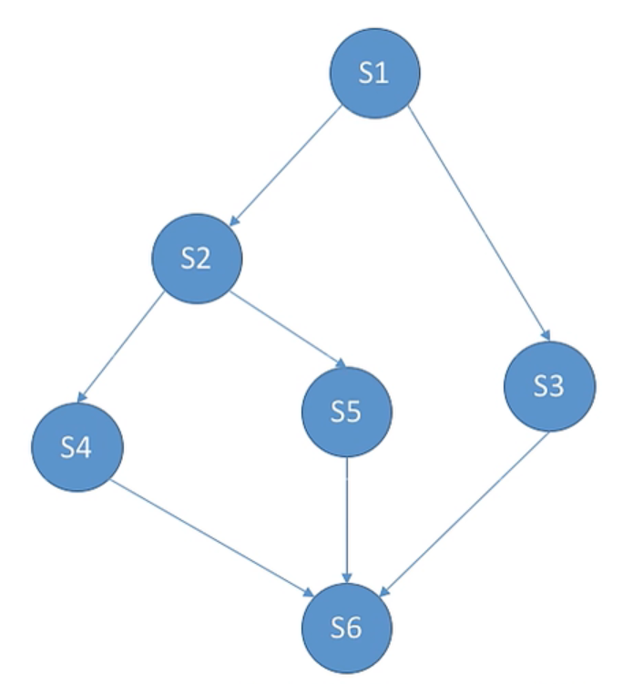

如果要实现这样顺序执行各个线程，只需要为每一对前驱关系各设置一个同步变量。

```java
Semaphore s1_s2 = 0,s2_s4 = 0;
//s1 → s2 → s4
void s1(){
    code;
    V(s1_s2); 
}

void s2(){
    P(s1_s2); 
    code;
    V(s2_s4);
}

void s4(){
    P(s2_s4); 
    code;
}
```

------

### 进程同步与互斥经典问题

#### 生产者消费者问题

系统中有一组生产者进程和一组消费者进程。生产者进程每次生产一个产品放入缓冲区，消费者每次从缓冲区中取出一个产品并使用。生产者进程和消费者进程共享一个初始大小为0、大小为n的缓冲区。

只有当缓冲区没满时，生产者才能将产品放入缓冲区，否则必须等待。
只有当缓冲区不为空时，消费者才能从缓冲区取出产品，否则必须等待。
缓冲区是临界资源，各进程必须互斥的访问。


```java
Semaphore mutex = 1;   //互斥信号量，实现对缓冲区互斥的访问
Semaphore space = n;   //同步信号量，表示空闲缓冲区的数量
Semaphore product = 0; //同步信号量，表示产品的数量

void producer(){
    while(true){
        produce a product;
        
        P(space);   //消耗一个空闲缓冲区
        
        P(mutex);   //互斥访问缓冲区
        put the product into the buffer;
        V(mutex);   //互斥访问缓冲区
        
        V(product); //增加一个产品
    }
}

void consumer(){
    while(true){
        P(product); //消耗一个产品
        
        P(mutex);   //互斥访问缓冲区
        take a product from the buffer;
        V(mutex);   //互斥访问缓冲区
        
        V(space); //增加一个空闲缓冲区
        
        consume the product;
    }
}
```

P操作顺序不能互换，因为P操作有可能会导致进程的阻塞，如果先加锁临界区，则会导致进程阻塞在临界区内，产生死锁。  

例如：P(mutex); → P(space); 此时如果space=0,生产者进程会被阻塞，切换到消费者进程，但是临界区资源仍然被生产者进程占用着，所以消费者进程也被阻塞。

V操作不会产生阻塞，所以V操作顺序可以调换。使用和生产产品代码可以放到临界区内，但是这样会使得驻留临界区的时间变长，降低并发度。 

------

#### 吸烟者问题


假设一个系统有三个抽烟者进程和一个供应者进程。每个抽烟者不停地卷烟 并抽掉它。抽烟者需要有三种材料：烟草、纸和胶水。三个抽烟 者中，第一个拥有烟草、第二个拥有纸，第三个拥有胶水。供应者进程无限地提供三种材料， 供应者每次将两种材料放到桌子上，拥有剩下那种材料的抽烟者卷一根烟并抽掉它，并给供 应者一个信号告诉完成了，供应者就会放另外两种材料在桌上，这种过程一直重复（让三个 抽烟者轮流地抽烟)。

```java
Semaphore tobaccoAndPaper=0; //定义信号量对应烟草和纸组合的资源
Semaphore tobaccoAndGlue=0;  //定义信号量对应烟草和胶水组合的资源
Semaphore paperAndGlue=0;    //定义信号量对应纸和胶水组合的资源
Semaphore finish=0;          //定义信号量表示抽烟是否完成

void provider(){
    while(true){
        for(int i=0; i<3; i++){
            if(random==0)
                V(tobaccoAndPaper) ; //提供烟草和纸
            else if(random==l)
                V(tobaccoAndGlue);  //提供烟草和胶水
            else
                V(paperAndGlue)  //提供纸和胶水
            // 任意两种材料放在桌子上;
            P(finish);
        }
    }
}

void tobaccoOwner(){
    while(true){
        P(paperAndGlue);
        smoke;
        V(finish);
    }
}

void paperOwner(){
    while(true){
        P(tobaccoAndGlue);
        smoke;
        V(finish);
    }
}

void glueOwner(){
    while(true){
        P(tobaccoAndPaper);
        smoke;
        V(finish);
    }
}
```

------

#### 读者写者问题

有读者与写者两个并发进程共享一个数据，两个或以上的读进程可以访问数据，但是一个写者进程访问数据与其他进程都互斥。

读者读者：同时访问临界区没有任何问题
读者写者：写者修改临界区数据，可能会导致读者读出的数据被修改过
写者写者：可能导致数据错误，或者被覆盖

因此，读写进程访问临界区规则如下

1. 允许多个读者进程进入临界区
2. 只允许一个写者进入临界区

```java
Semaphore mutex_data = 1;   //互斥信号量，实现对缓冲区互斥的访问
int count = 0;              //记录有多少个读者在缓冲区中
Semaphore mutex_count = 1;  //互斥信号量，实现对count互斥的访问

void writer(){
    P(mutex_data);
    write;
    V(mutex_data);
}

void reader(){
    P(mutex_count);
    if(count == 0)
    	P(mutex_data); //第一个读进程上锁，后面的读进程直接进来就行
    count++;
    V(mutex_count);
    
    read;
    
    P(mutex_count);
    count--;
    if(count == 0) //最后一个读进程解锁
    	V(mutex_data);
    V(mutex_count);
}
```

if(count == 0) → if(count == 0) → P(mutex_data) → P(mutex_data)可能造成多重上锁，所以count也要互斥访问。

潜在问题：只要有读进程在读，写进程就必须要等待。如果一直有读进程进入缓冲区，则会造成**写进程饥饿**

```java
Semaphore rw = 1;           //互斥信号量，实现读写进程互斥访问
Semaphore w = 1;            //用于实现读写公平
int count = 0;              //记录有多少个读者在缓冲区中
Semaphore mutex_count = 1;  //互斥信号量，实现对count互斥的访问

void writer(){
    P(w);
    P(rw);
    write;
    V(rw);
    V(w);
}

void reader(){
    P(w);
    P(mutex_count);
    if(count == 0)
    	P(rw); //第一个读进程上锁，后面的读进程直接进来就行
    count++;
    V(mutex_count);
    V(w);
    
    read;
    
    P(mutex_count);
    count--;
    if(count == 0) //最后一个读进程解锁
    	V(rw);
    V(mutex_count);
}

```

w信号量使得读进程不再拥有能够无限进入临界区的权限，而是要和写进程争抢进入临界区的权限。从而实现读写公平。

------

#### ==哲学家进餐问题==

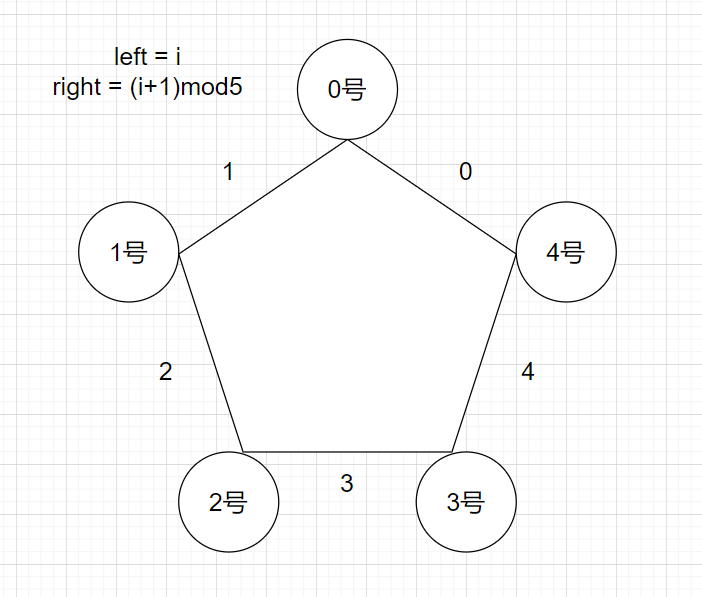

一张桌子上坐着五个哲学家，每两个哲学家之间放有一根筷子，桌子的中间是一碗米饭。哲学家有两种状态：思考与进餐。当哲学家在思考的时候，不影响他人；当哲学家饥饿时，才会试图依次拿起位于他左右的两根筷子。如果筷子已被他人拿起，则等待。饥饿的哲学家只有同时拿起两根筷子才可以进餐，进餐完毕后继续思考。

```java
Semaphore chopstick[5]{1,1,1,1,1};

void pi(int i){
    while(true){
        P(chopstick[i]);
        P((chopstick[i]+1)mod5);
        eat;
        V(chopstick[i]);
        V((chopstick[i]+1)mod5);
        think;
    }
}
```

所有哲学家都拿起了左边的筷子，P(chopstick[0]) → P(chopstick[1]) → P(chopstick[2]) → P(chopstick[3]) → P(chopstick[4]) ，会导致互相等待死锁。

==解决方案=


------

## 管程

信号量和管程是等价的，可以使用信号量实现管程，也可以使用管程实现信号量。管程就是指管理共享变量，以及对共享变量的相关操作。具体到 Java 语言中，管程就是管理类的成员变量和方法，让这个类是线程安全的。

管程是通过编译器实现的，管程内定义的操作在同一时刻只被一个进程调用。

```java
class ProductManager{
    int size;            //缓冲区大小
    int productNum = 0;  //产品数量

    List<Thread> producerWaitingList; 
    List<Thread> consumerWaitingList;

    synchronized void insert(Proudct P){
        if(productNum == size) //缓冲区满了则阻塞接下来的生产者进程
            wait(producerWaitingList);
        productNum++;

        insert product;

        if (productNum == 1) //缓冲区空时阻塞了消费者进程，所以在生产产品后唤醒
            signal(consumerWaitingList);
    }

    synchronized Porduct remove(){
        if(productNum == 0) //缓冲区空了则阻塞接下来的消费者进程
            wait(consumerWaitingList);
        productNum--;

        remove product;

        if (productNum == size-1) //缓冲区满时阻塞了生产者进程，所以在消费产品后唤醒
            signal(producerWaitingList);
    }
}

public class Main{
    void producer(ProductManager pm){
        Product p = new Product();
        while(true){
            pm.insert(p)
        }
    }
    
    void consumer(ProductManager pm){
        while(true){
            Product p = pm.remove();
            consume product;
        }
    }
}
```

------

## 死锁

**死锁：**各个进程互相等待对方手里的资源，导致各进程堵塞无法推进的现象。
**饥饿：**由于长期得不到想要的资源，某进程无法推进的现象。例如短进程优先算法有可能会导致长进程饥饿。
**死循环：**某进程执行过程中一直跳不出某个循环的现象。


### 死锁的必要条件

1. **互斥**：涉及的资源是非共享的，即一次只能有一个进程使用。如果有另一个进程申请该资源，那么申请进程必须等待，直到该资源被释放。
2. **不可剥夺：**进程所获得的资源在未使用完毕之前，不能被其他进程强行夺走，即只能由获得该资源的进程自行释放。
3. **占有并等待：**进程每次申请它所需要的一部分资源。在等待一新资源的同时，进程继续占用已分配到的资源。
4. **循环等待：**存在一种进程收尾相接的循环链，链中每个进程都在等待下一个进程所持有的资源，造成这组进程处于永远等待状态。

------

### 静态策略：预防死锁

**破坏互斥条件：**

把只能互斥使用的资源，改为可以共享使用的资源。例如SPOOLing技术，逻辑上把输出设备看为共享设备。

**缺点：**

不是所有的资源都可以改造成可共享资源。因此很多时候都无法破坏互斥条件。


**破坏不可剥夺条件：**

- **方案1：**当一个已经持有了一些资源的进程在提出新的资源请求没有得到满足时，它必须释放已经保持的所有资源，待以后需要使用的时候再重新申请。
- **方案2：**当某个进程需要的资源被其他进程所占有的时候，可以有操作系统协助，将想要的资源强行剥夺。

**缺点：**

1. 实现复杂
2. 释放已获得的资源可能造成前一阶段工作失效
3. 反复申请和释放资源会增加系统开销，降低系统吞吐量
4. 若采用方案一，如果一直发生得不到资源的情况，会造成进程饥饿

1. **缺点：**


**破坏请求和保持条件：**

采用静态分配方法，即在进程运行前一次申请完它所需要的全部资源，在它资源未满足之前，不让它投入运行。

**缺点：**

有些资源只用使用很短的时间，但是在进程运行期间一直被占用着。会造成严重的资源浪费，资源利用率低。同时也可能造成部分进程饥饿。


**破坏循环等待条件：**

采用顺序资源分配法，首先给系统中的资源编号，规定每个进程必须按**编号递增**的顺序请求资源，同类资源（即编号相同的资源）一次申请完。
一个进程只有已经占有小编号资源的时候，才有资格申请大编号资源。按此规则，已持有大编号资源的进程，不可能逆向地回来申请小编号的资源，从而不会产生循环等待的条件。

**缺点：**

1. 不方便新增设备，因为可能需要重新分配所有的编号
2. 进程实际使用资源的顺序可能和编号递增的顺序不一致，会导致资源的浪费。（音响1号，打印机2号，如果申请使用打印机，虽然不需要音响，但也需要占用音响）
3. 必须按次序申请资源，用户编程麻烦

------

### 动态策略：避免死锁

#### 安全序列

如果系统按照这种序列分配资源，则每个进程都能顺利的完成。只要找出一个安全序列，系统就是**安全状态**。安全序列可能有多个。

如果分配了资源之后，系统找不出任何一个安全序列，系统就进入了**不安全状态**。这就意味着之后可能所有的进程都无法顺利的执行下去。（如果有进程提前归还了一些资源，那系统也有可能重新回到安全状态）

如果系统处于安全状态，那就**一定**不会发生死锁。如果系统进入不安全状态，就**可能**发生死锁。

**实现：**

1. 检查当前剩余资源是否满足某进程的最大需求
2. 如果可以则将该进程加入安全序列，并回收其持有的所有资源
3. 重复上述过程，看是否能将所有进程都放入安全序列

**例子：**

设资源 A:10	B:5	C:7		5个进程P0~P4

| 进程 | 最大需求 | 已分配  | 还需要  | 安全序列 |
| ---- | -------- | ------- | ------- | -------- |
| P0   | (7,5,3)  | (0,1,0) | (7,4,3) | 2        |
| P1   | (3,2,2)  | (2,0,0) | (1,2,2) | 1        |
| P2   | (9,0,2)  | (3,0,2) | (6,0,0) | 2        |
| P3   | (2,2,2)  | (2,1,1) | (0,1,1) | 1        |
| P4   | (4,3,3)  | (0,0,2) | (4,3,1) | 2        |

剩余资源：（3,3,2）→ 满足P1或P3的需求 → 资源先后分配给P1和P3后，等P1和P3运行完回收已分配给它们的资源 → 
剩余资源：（7,4,3）→ 满足P0、P2、P4的需求


#### 银行家算法

**思想：**在资源分配之前预先判断此次分配是否会导致系统进入不安全状态，以此决定是否答应此次资源分配请求。

**实现：**

- 用一个N*M的矩阵**max**表示所有进程对各种资源的最大需求数（N：进程数，M：资源数）
- 用一个N*M的矩阵**allocation**表示所有进程对各种资源的分配情况
- 用一个N*M的矩阵**need**表示所有进程还需要多少各类资源
- 用一个M大小的数组**remaining**表示剩余资源
- 用一个M大小的数组**request**表示此次请求多少资源

设资源 A:10	B:5	C:7		5个进程P0~P4
$$
\begin{bmatrix}
7 & 5 & 3\\
3 & 2 & 2\\
9 & 0 & 2\\
2 & 2 & 2\\
4 & 3 & 3\\
\end{bmatrix}
_{max}
-
\begin{bmatrix}
0 & 1 & 0\\
2 & 0 & 0\\
3 & 0 & 2\\
2 & 1 & 1\\
0 & 0 & 2\\
\end{bmatrix}
_{allocation}
=
\begin{bmatrix}
7 & 4 & 3\\
1 & 2 & 2\\
6 & 0 & 0\\
0 & 1 & 1\\
4 & 3 & 1\\
\end{bmatrix}
_{need}
$$

$$
\begin{bmatrix}
3 & 3 &2
\end{bmatrix}
_{remaining}
\quad
\begin{bmatrix}
A & B &C
\end{bmatrix}
_{Pi\;request}
$$

1. 如果Pi_request < Pi_need 转2；否则出错
2. 如果Pi_request < remaining 转3；否则出错
3. 将资源尝试着分配给Pi并更新remaining、Pi_allocation、Pi_need
4. 操作系统查找此次分配后是否存在一个**安全序列**。若存在则正式分配资源，否则回滚数据并阻塞该进程。

------

### 死锁的检测

#### 资源分配图

系统死锁，可利用资源分配图来描述。用圆圈代表一个进程，用框代表一类资源。由于一种类型的资源可能有多个，用框中的一个点代表一类资源中的一个资源。从进程到资源的有向边叫请求边，表示该进程申请一个单位的该类资源；从资源到进程的边叫分配边，表示该类资源已经有一个资源被分配给了该进程。


**资源分配图的化简**

可以通过将资源分配图简化的方法来检测系统状态S是否为死锁状态，化简完还有边的进程就是死锁进程。

1. 把不阻塞（“不阻塞”即：系统有足够的空闲资源分配给它）的进程的所有边都去掉，形成一个孤立的点
2. 看剩下的进程有哪些是不阻塞的，然后又把它们逐个变成孤立的点

### 死锁的解除

1. 剥夺资源法：挂起某些死锁进程，并抢占它们的资源，将这些资源分配给其他死锁进程。
2. 撤销进程法：强制撤销部分甚至全部死锁进程，并剥夺这些进程的资源。
3. 进程回退发：让一个或多个进程回退到足以避免死锁的地步。需要系统记录进程的历史信息，设置还原点。

------

# 线程

线程是一个基本的CPU执行单元，也是程序执行流的最小单位。使得进程内部也可以并发执行任务(例如QQ可以边视频，边打字，边传输文件)。

## 线程的实现方式

### 用户级线程

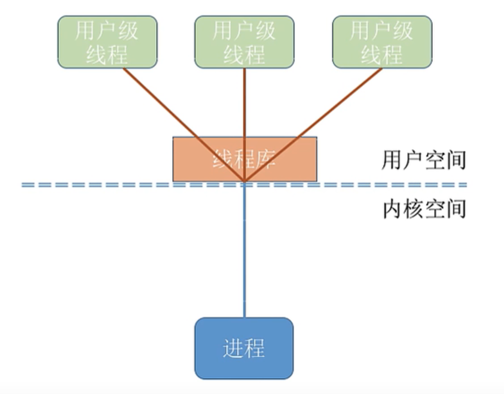

用户级线程由应用车需通过线程库实现。所有的线程管理工作都由应用程序负责(包括线程切换)。

用户级线程中，线程切换可以在用户态下完成，无需操作系统介入。

在用户看来，是有多个线程。但是在操作系统内核看来，并意识不到线程的存在。


### 内核级线程


内核级线程的管理工作由操作系统内核完成。线程调度、切换等工作都由内核负责，因此内核级线程的切换必然需要在核心态下才能完成。


### 混合型线程

#### 多对一模型

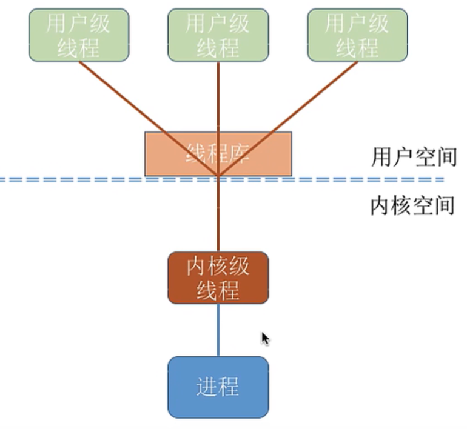

多个用户级线程映射到一个内核级线程。每个用户进程只对应一个内核级线程。

- 优点：用户级线程的切换在用户空间既可完成，不需要切换到核心态，线程管理系统开销小，效率高。

- 缺点：当一个用户级线程被阻塞后，整个进程都会被阻塞，并发度不高。


#### 一对一模型

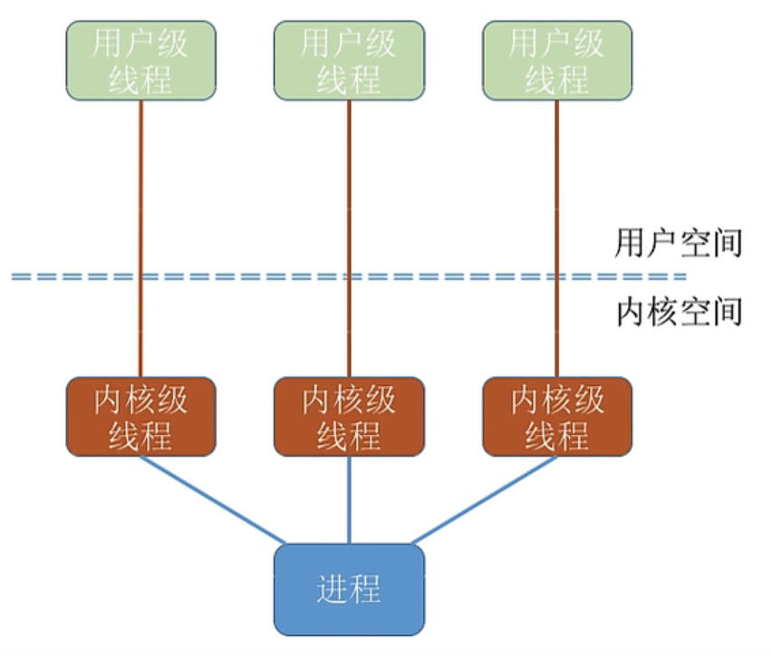

一个用户级线程映射到一个内核级线程。

- 优点：当一个线程被阻塞后，别的线程还可以继续执行，并发能力强。

- 缺点：线程切换由操作系统内核完成，需要切换到核心态，因此线程管理的成本高，开销大。


#### 多对多模型

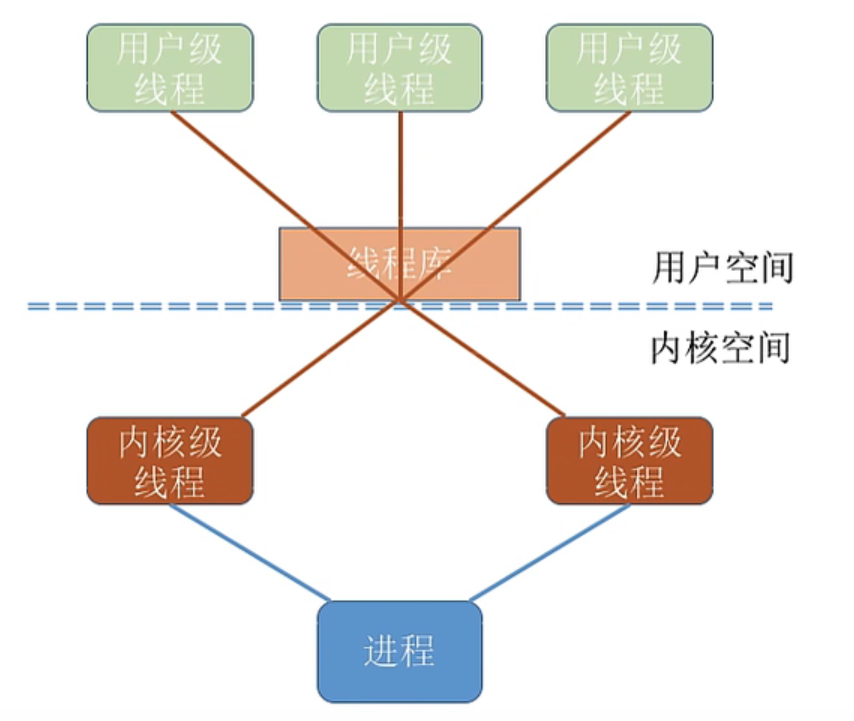

可以将N个用户级线程映射到M个内核级线程上。(N ≥ M)

克服了多对一模型并发度不高的缺点，又克服了一对一模型中一个用户进程占用太多内核级线程，开销太大的缺点。

**==内核级线程才是处理机调度的单位==**

------

# 内存

## 装入的三种方式

1. **绝对装入:**在编译时，如果知道程序将放到内存中的哪个位置，编译程序将产生绝对地址的目标代码。装入程序按照装入模块中的地址，将程序和数据装入内存。
2. **静态重定位:**编译、链接后的装入模块的地址都是从0开始的，指令中使用的地址、数据存放的地址都是相对于起始地址而言的逻辑地址。可根据内存的当前情况，将装入模块装入到内存的适当位置。装入时对地址进行“重定位”，将逻辑地址变换为物理地址(地址变换是在装入时一次完成的)。 静态重定位的特点是在一个作业装入内存时，必须分配其要求的全部内存空间，如果没有足够的内存，就不能装入该作业。 **作业一旦进入内存后，在运行期间就不能再移动，也不能再申请内存空间。**
3. **动态重定位:**又称动态运行时装入。编译、链接后的装入模块的地址都是从0开始的。装入程序把装入模块装入内存后，并不会立即把逻辑地址转换为物理地址，而是把地址转换推迟到程序真正要执行 时才进行。因此装入内存后所有的地址依然是逻辑地址。这种方式需要一个重定位寄存器的支持。**(采用动态重定位时允许程序在内存中发生移动)**

 **逻辑地址**是在有地址变换功能的计算机中,指令给出的地址 (操作数) 是相对地址。要经过寻址方式的计算或变换才得到内存储器中的实际有效地址即物理地址

------

## 连续分配

系统为用户作业分配的必须是一个连续的内存空间。


### 固定分区分配

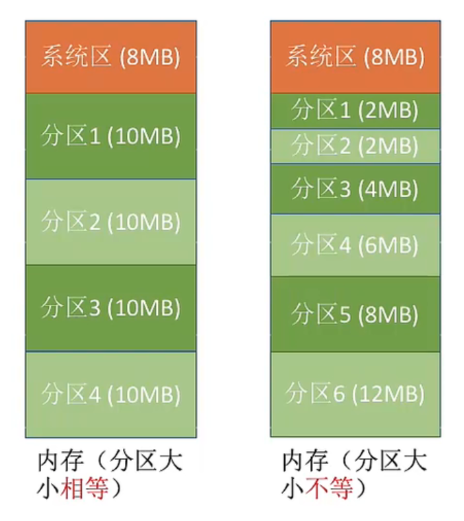

系统将内存空间划分为多个固定大小的区域，在每个分区中只装入一个进程。

------

### 动态分区分配

在进程进入内存时，根据进程的大小动态地建立分区，并使分区的大小正好适应进程的需要，因此系统中分区的大小是可变的，分区的数目也是可变的。


#### 动态分区分配算法

##### 首次适应算法

- **思想：**每次都从低地址开始查找，找到第一个能满足大小的空闲分区。
- **实现：**空闲分区以地址递增的次序排列。每次分配内存时顺序查找空闲分区链（或空闲分区表），找到大小能满足要求的第一个空闲分区。
- **优点：**首次适应算法倾向于优先利用内存中低址部分的空闲分区，从而保留了高址部分的大空闲区。这给为以后到达的“大进程”所需要大的内存空间创造了条件。
- **缺点：**低址部分不断被划分，会留下许多难以利用的、很小的空闲分区。而每次查找又都是从低址部分开始，这无疑会增加查找可用空闲分区时的开销。

##### 最佳适应算法

- **思想：**优先使用更小的空闲区。
- **实现：**空闲分区按容量递增次序链接。每次分配内存时顺序查找空闲分区链（或空闲分区表），找到大小满足要求的第一个空闲分区。
- **优点：**当“大进程”到来时能有连续的大片空间。
- **缺点：**会留下越来越多的、很小的、难以利用的内存块。因此这种方法会产生很多的外部碎片。

##### 最坏适应算法

- **思想：**优先使用最大的连续空闲区。
- **实现：**空闲分区按容量递减次序链接。每次分配内存时顺序查找空闲分区链（或空闲分区表），找到大小满足要求的第一个空闲分区。
- **优点：**剩下的空闲区不会太小，更方便使用，不会留下太多难以利用的外部碎片。
- **缺点：**会导致较大的连续空闲区被迅速用完，当“大进程”到达时，就没有空闲的内存分区可用了。

##### 循环首次适应算法(临近适应算法)

- **思想：**该算法是由首次适应算法演变而成的。在为进程分配内存空间时，不再是每次都从头开始查找，而是从上次找到的空闲分区的下一个空闲分区开始查找，

- **实现：**空闲分区以地址递增的顺序排列（可排成一个循环链表）。每次分配内存时从上次查找结束的位置开始查找空闲分区链（或空闲分区表），找到大小能满足要求的第一个空闲分区。

- **优点：**首次适应低址部分不断被划分，会留下许多难以利用的、很小的空闲分区。而每次查找又都是从低址部分开始，这无疑会增加查找可用空闲分区时的开销。循环首次适应算法优化了查找分区的开销。

- **缺点：**该算法能使内存中的空闲分区分布得更均匀，但这样会缺乏大的空闲分区。 

------

## 非连续分配

为用户进程分配的可以是一些分散的内存空间。

### 分页存储管理

**页框（page frame）：**将内存空间分为一个个大小相等的分区（比如每个分区是4KB）。每个页框有一个编号，即“页框号”。

**页（page）：**将用户进程的地址空间分为一个个大小与**页框相等**的分区。每个页面有一个编号，即“页号”。（进程的最后一个页面可能没有一个页框那么大，因此页框不能太大，否则可能产生过大的内部碎片）。

操作系统以页框为单位为各个进程分配内存空间。进程的每个页分别放入一个页框当中。

**计算物理地址过程**

1. 计算出逻辑地址所对应的页号
2. 页号所对应的页框在内存中的起始物理地址
3. 逻辑地址在页内的偏移量

**页号** = 逻辑地址/页框大小（向下取整）

**页内偏移量** = 逻辑地址%页框大小

------

#### **页框大小的设计**

**页框大小一般都为2的整数幂**

假设用32位表示逻辑地址（**按字节寻址**），页框大小为$2^{12}$Byte = 4KB


0号页的逻辑地址空间为：0 ~ $2^{12}$-1

- 0000 0000 0000 0000_0000 0000 0000 0000 ~ 0000 0000 0000 0000_1111 1111 1111 1111

1号页的逻辑地址空间为：$2^{12}$ ~ $2^{13}$-1

- 0000 0000 0000 000**1**_0000 0000 0000 0000 ~ 0000 0000 0000 000**1** _1111 1111 1111 1111

2号页的逻辑地址空间为：$2^{13}$ ~ $2^{14}$-1

- 0000 0000 0000 00**1**0_0000 0000 0000 0000 ~ 0000 0000 0000 00**1**0_1111 1111 1111 1111

可以看出，如果页框大小为$2^k$B，用二进制表示逻辑地址，则末位的K位为页内偏移量，前面的部分就是页号。

------

#### 单级页表

为了能知道进程的每个页所对应的页框，操作系统要为每个进程创建一张页表。当进程未被执行的时候，页表的起始地址和长度会存在PCB当中。当进程被调度的时候，操作系统内核会把页表放入页表寄存器中。（**页表一般是连续存储的**，就像数组下标一样，==**页号其实不存在的**==）

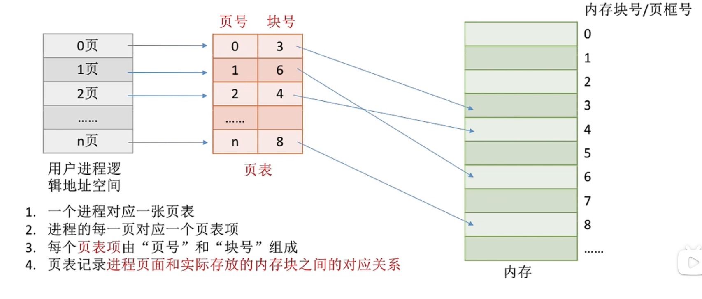

**计算物理地址过程**

1. 算页号、业内偏移量

2. 检查页号合法性

3. 查页表，找到存放页面的页框号（访问内存一次）

4. 根据页框号和页内偏移量得到物理地址

5. 访问目标内存单元（访问内存两次）


------

#### 两级页表

**单级页表存在的问题**

1. 页表必须连续存放，因此当页表很大的时候，需要占用很多连续的页框。(多级页表解决)
2. 没有必要让整个页表常驻内存，因为进程一段时间内有可能只需要访问特定的几个页面。(虚拟内存解决)

设计算机系统最大寻址为32位，按字节（Byte）寻址，一个页框大小为4KB，页表项长度为4B。

- 4KB = $2^{12}$B，因此页内地址为12位，页号为20位
- 因此用户进程最多有$2^{20}$页，一个页表最大有可能会达到 $2^{20}$ * 4B = 4MB，需要1K个页框存储
- 根据局部性原理，一个进程在一段时间内有可能只需要访问特定的几个页面，但是单级页表却需要将整个页表放入内存当中

**解决方案**

将页表也进行分组，使每个分组大小刚好等于一个页框。再将各组也离散的放入各个页框当中。并为离散的页表项再建立一张页表。

如上面的例子，一个页表项大小为4B，页框大小4KB，则每连续的1K个页表项为一组，每组刚好占一个页框。

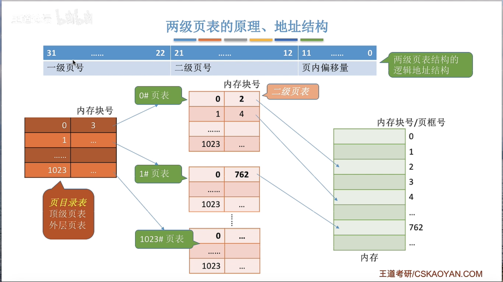

**计算物理地址过程**

将逻辑地址 0000 0000_0000 0001_1111 1111_1111 1111 转化为物理地址

1. 按地址结构，将逻辑地址拆分为三部分 0000 0000 00，00 0001 1111，1111 1111 1111
2. 从PCB中读出顶级页表初始地址，根据顶级页表的页号，查找对应的页表项。找到二级页表所在的页框号。
3. 在二级页表中查找二级页号所对应的页表项。并从中取得最终要访问的页框号。
4. 根据页框号和页内偏移量，取得物理地址。

==**各级页表的大小不能超过一个页面。**==


------

#### 快表(TLB)

快表，又称联想寄存器（translation lookaside buffer），是一种访问速度比内存快很多的高速缓冲存储器，用来存放当前访问的若干页表项，以加速地址变换的过程。与此对应，内存中的页表常称为慢表。

##### 局部性原理

###### 时间局部性原理

如果执行了程序中的某条指令，那么不久后这条这令很有可能再次执行。如果某个数据被访问过，不久后该数据很可能再次被访问。(因为程序中存在大量的循环)

###### 空间局部性原理

一旦程序访问了某个存储单元，在不久之后，其附近的存储单元也很有可能被访问。(因为很多数据在内存中都是连续存放的)

**计算物理地址过程**

1. 算页号、业内偏移量
2. 检查页号合法性
3. 查快表。若快表中有该页号，即可知道页面所在的页框号，转到5。若没命中转到4。
4. 查页表，找到存放页面的页框号，并将页表项复制到快表中（访问内存一次）
5. 根据页框号和页内偏移量得到物理地址
6. 访问目标内存单元（访问内存两次）

------

### 分段存储管理


进程的地址空间，按照程序自身的逻辑关系，划分成诺干个段，每个段都有一个段名，每段从0开始编址。每个段在内存中占据连续的空间，但各个段之间可以不相临。（分段存储管理需要程序员显式的给出段号，段内地址）


#### 段表

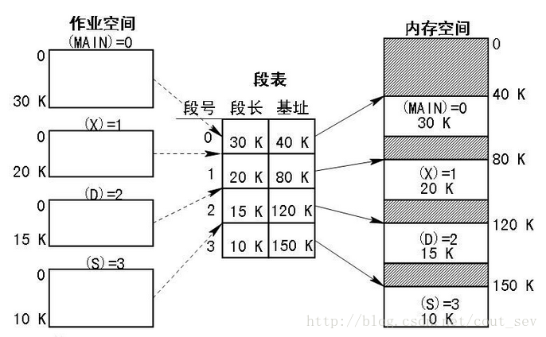

**计算物理地址过程**

1. 根据逻辑地址，得到段号，段内地址。
2. 检查段号合法性
3. 查段表，找到对应的段表项（访问内存一次）
4. **检查段内地址合法性**
5. 根据基址和段内偏移量得到物理地址
6. 访问目标内存单元（访问内存两次）

------

### 段页式存储管理


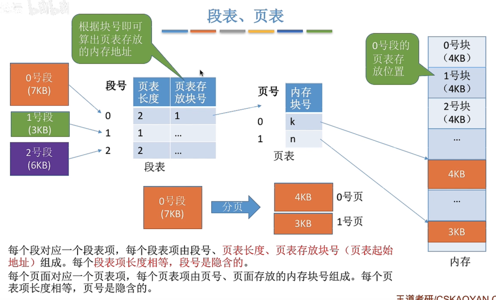

**计算物理地址过程**

1. 根据逻辑地址，得到段号，页号，页内偏移量。
2. 检查段号合法性
3. 查段表，找到对应的段表项（访问内存一次）
4. 检查页号合法性
5. 根据页表所在的页框号和页号，找到对应页表项（访问内存两次）
6. 根据页框号和页内偏移量得到物理地址
7. 访问目标内存单元（访问内存三次）

------

### 虚拟内存

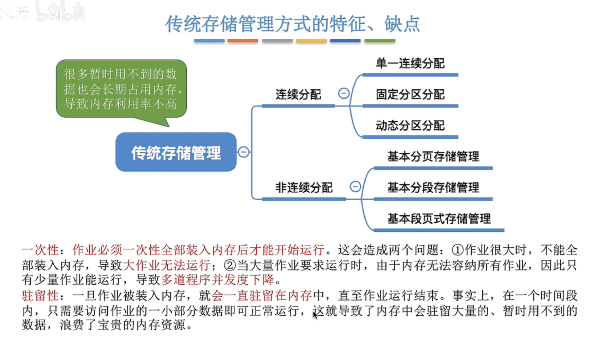

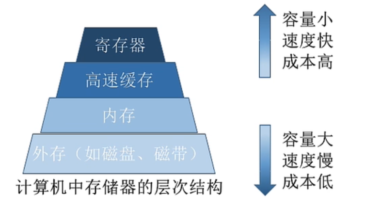

- 基于局部性原理，在程序装入时，可以将程序中很快会用到的部分装入内存，暂时用不到的部分留在外存。
- 在程序执行的过程中，当所访问的信息不在内存时，由操作系统负责将所需信息从外存调入内存。
- 若内存空间不够，由操作系统负责，将内存中暂时用不到的信息换出到外存。
- 在操作系统的管理下，在用户看来，似乎有一个比实际内存大的多的内存，这就是虚拟内存。

虚拟内存的最大容量是由CPU的寻址范围确定的。

虚拟内存的实际容量 = min(内存+外存，CPU寻址范围)

**页表的改动**

1. 状态位：标记目标页是否在内存中
2. 访问字段：记录被访问次数或者上次访问的时间，供页面置换算法参考
3. 修改位：是否被修改过，只有修改过的页面才需要被写回外存
4. 外存地址：页面在外存存放的位置

**驻留集：**指请求分页存储管理中给进程分配的物理页面（块）的集合。
**工作集：**是指在某段时间间隔里，进程实际要访问的页面的集合。
**固定分配：**驻留集大小不可变
**可变分配：**驻留集大小可变
**局部置换：**只置换进程自己的页面
**全局置换：**可以换出别的进程的页面

#### 抖动

又称颠簸,指刚被调出去的页需要马. 上被调回,刚调回不久又要被调出。频繁调入调出，使系统的大部分时间都花费在内存和外存之间的来回折腾上。抖动主要表现为磁盘I/O极度繁忙，而处理机大量时间空闲，CPU有效利用率降低。

抖动的预防措施

1. 在处理机调度中引|入工作集策略
2. 采用局部置换策略防止抖动扩散
3. 挂起部分进程
4. L=S准则，这里L是产生缺页的平均时间，S是系统处理缺页的平均时间。理论证明，当L=S是处理机的利用率最高。

------

#### 页面置换算法

##### 最佳置换算法 (OPT)

- 思想：每次选择淘汰的的页面，将会是在在未来最长时间内不再被访问的页面，这样可以保证最低的缺页率。
- 实现：最佳置换算法只是一种理想的算法，实际应用中是无法实现的。

##### 先进先出置换算法 (FIFO)

- 思想：每次选择最早进入内存的页面淘汰。
- 实现：把调入内存的页面根据调入的先后顺序排成一个队列，每次置换队头页面。
- 优点：实现容易。
- 缺点：带在内存中很久的页面，有可能是经常被访问的页面。

##### 最近最久未使用置换算法 (LRU)

- 思想：每次选择最近最久没使用的页面淘汰。
- 实现：在每个页面对应的页表项中增加一个字段记录自上次访问来所经历的时间，每次淘汰时间最久的。
- 优点：算法性能好。
- 缺点：实现困难，需要计时硬件支持。

##### 时钟置换算法 (CLOCK) / 最近未用算法(NRU)

- 思想：
- 实现：为每个页面设置一个访问位，并将页面通过指针链接成一个环形链表。当某一页首次装入主存时或者被访问到时，它的使用位被置为1。当需要淘汰一个页面的时候，只需要检查页的访问位：如果是**0**，则**直接换出**；如果是**1**，则**标为0**，**不换出**，**继续检查**下个页面。**如果全为1的话，会经过两次扫描。**
- 优点：性能接近LRU，实现较简便。
- 缺点：淘汰一个页面最多可能会经历两次扫描。

##### 改进型时钟置换算法

- 思想：时钟置换算法仅考虑到一个页面是否被访问过，但是一个页面如果只被访问，而没有被修改，是不用写回外存的。因此除了考虑一个页面最近是否被访问过外，还应该考虑是否被修改过。在其他条件都相同的情况下，应该优先淘汰没有被修改过的页面。避免I/O操作。
- 实现：在时钟置换算法的基础上，再多增加一个修改位。[访问位 , 修改位]
  1. 第一轮扫描，从当前位置开始扫描，查找第一个 [ 0 , 0 ] 的页面替换。 **（未访问，未修改）**
  2. 第二轮扫描，若第一轮扫描失败，则重新扫描，查找第一个 [ 0 , 1 ] 的页面替换，并将访问位置为0。**（未访问，已修改）**
  3. 第三轮扫描，若第二轮扫描失败，则重新扫描，查找第一个 [ 0 , 0 ] 的页面替换。**（访问，未修改）**
  4. 第四轮扫描，若第三轮扫描失败，则重新扫描，查找第一个 [ 0 , 1 ] 的页面替换。**（访问，已修改）**
- 优点：相比时钟置换算法减少了I/O次数。
- 缺点：淘汰一个页面最多可能会经历四次扫描。
