
# 计算机系统概论

## 冯诺依曼计算机结构

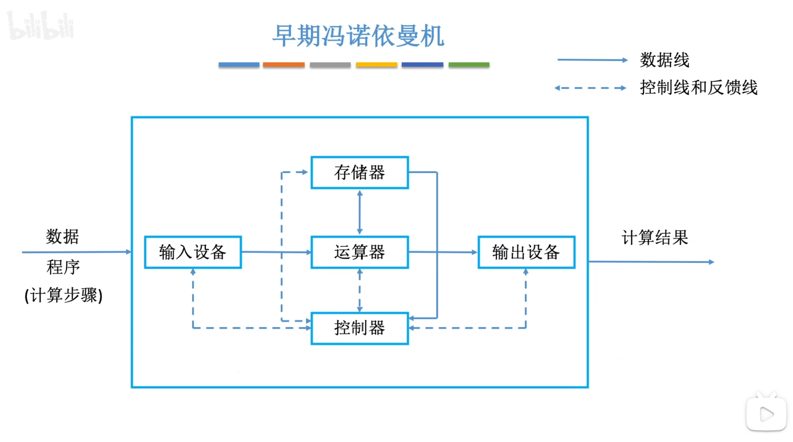

------

## 存储器为中心的计算机结构

------

## 计算机系统的层次结构

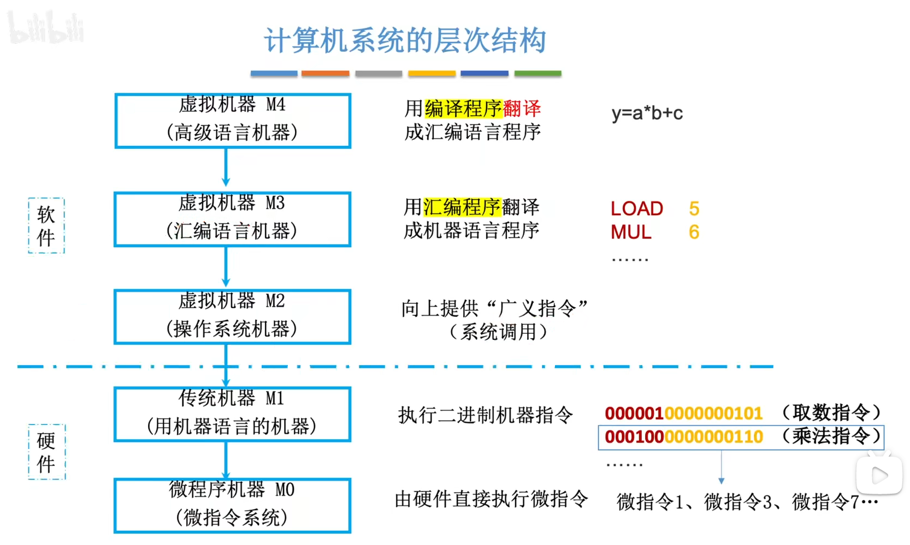

------

## 计算机硬件的主要技术指标

### 存储容量

存储容量 = 存储单元个数 * 存储字长

常用大小
$$
1Byte(B) = 8bit(b)\\
1K = 1024 = 2^{10};\; 1M = 1024K = 2^{20};\; 1G = 1024M = 2^{30};\; 1T = 1024G = 2^{40}
$$
**例子**：MAR：16位，MDR：32位，求存储容量？
$$
2^{16} * 32 = 2^{21}(bit) = \frac {2^{21}}{2^{20}*2^3} = \frac {1}{4}(MB) = 256(KB)
$$

### 运算速度

赫兹（Hz）：是频率的国际单位制单位，表示每一秒周期性事件发生的次数

CPI（Clock cycle Per Instruction）：执行一条指令所需的时钟周期数 （不同指令CPI不同，甚至相同指令CPI也可能不同）

IPS （Instruction Per Second）：每秒执行的指令数

IPS = 主频 / 平均CPI

FLOPS（Floating-point Operations Per Second）：每秒执行多少次浮点运算

------

## 计算机的基本组成

### 运算器

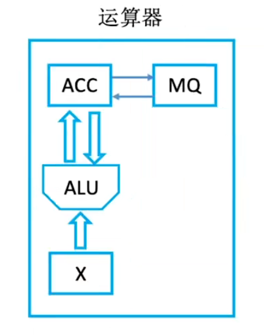

- ACC（Accumulator)：累加器，用于存放操作数或者运算结果
- MQ（Multiple-Quotient Register）：乘商寄存器，在乘除运算中，用于存放操作数或者运算结果
- ALU（Arithmetic and Logic Unit）：算数逻辑单元，通过内部电路实现算数运算和逻辑运算
- X：操作数寄存器

不同运算时，存放的操作数类别并不相同

|      | 加法       | 减法       | 乘法           | 除法         |
| ---- | ---------- | ---------- | -------------- | ------------ |
| ACC  | 被加数、和 | 被减数、差 | 乘积高位       | 被除数、余数 |
| MQ   |            |            | 乘数、乘数低位 | 商           |
| X    | 加数       | 减数       | 被乘数         | 除数         |

运算过程

- M：地址号
- [M]：地址号中的内容
- X：寄存器
- [X]：寄存器中的内容
- ACC：累加器
- [ACC]：累加器中的内容
- MQ：乘商寄存器
- [MQ]：乘商寄存器中的内容

| 加法                         | 减法                         | 乘法                                                         | 除法                                         |
| ---------------------------- | ---------------------------- | ------------------------------------------------------------ | -------------------------------------------- |
| [M] → X [ACC] - [X] → ACC | [M] → X [ACC] - [X] → ACC | [M] → MQ [ACC] → X 0 → ACC [X] * [MQ] → 高位存在ACC，低位存在MQ | [M] → X [ACC] / [X] → MQ 余数留在ACC中 |

------

### 控制器

- CU（Control Unit）：控制单元，分析指令，给出控制信号
- IR（Instruction Register）：指令寄存器，存放当前执行的指令
- PC（Program Counter）：程序计数器，存放下一条指令地址，有自动+1功能

完成一条指令：取指令（PC）→ 放入IR（IR）→ 分析，执行指令（CU）

------

### 主存储器

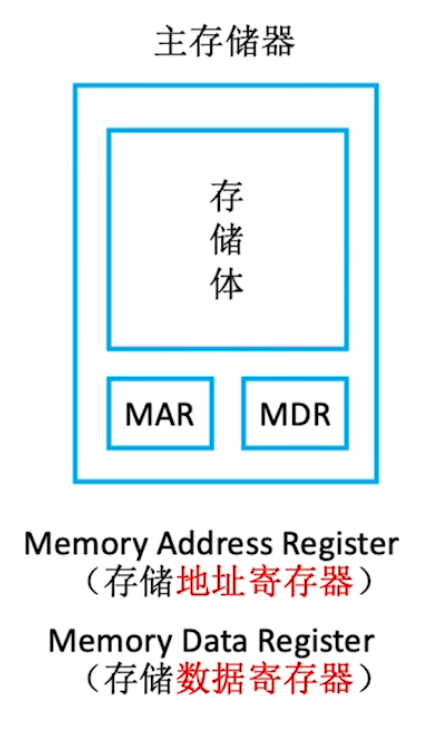 

- 存储单元：可存储一段二进制代码（寻址的最小单位是一个存储单元）
- 存储字(word)：存储单元所存储的二进制代码
- 存储字长：存储字的位数
- 存储元：存储二进制的电子元件。每个存储元可存储1bit

MAR（Memory Address Register）的位数，反映存储单元的个数

MDR（Memory Data Register）的位数，反映存储单元的大小

------

### Cache

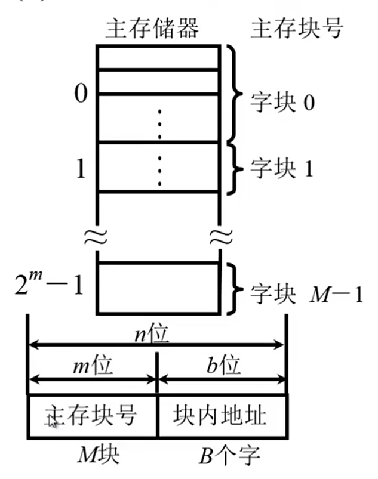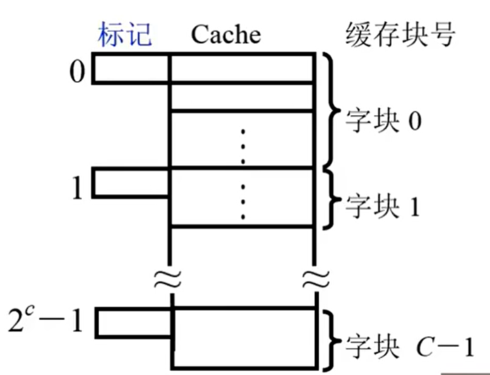

主存储器由$2^n$个字组成，每个字拥有一个n位的地址。将主存分成大小相同的M（$2^m$）块，每块内包含B（$2^b$）个字。缓存分成大小相同的C（$2^c$）块，每块内包含B（$2^b$）个字。**缓存的字块大小和主存保持一致**。

#### 地址映射

###### 直接映射

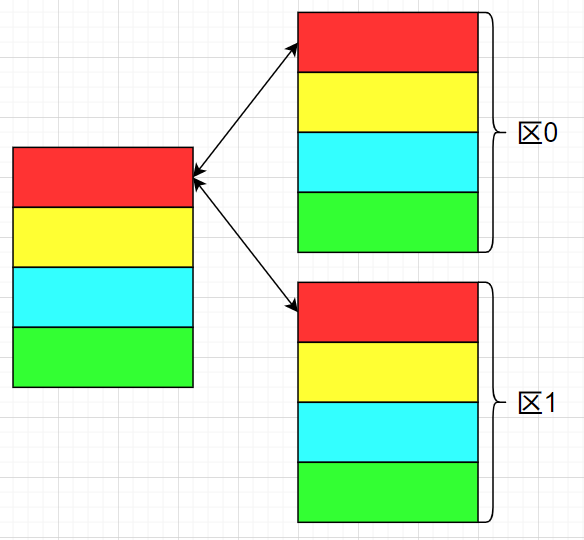

**Cache结构**

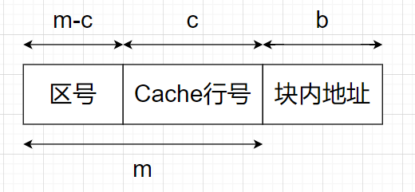

**存储原理：**将主存分区，每个区大小和Cache大小一致，区内的块存到Cache中对应的行。

- Cache行号 = 内存块号 % cache行数（二进制直接截断取后c位）
- 区号 = 内存块号 / cache行数（向下取整）（二进制直接取前m-c位）

| 缓存块号 | 主存块号                       |
| -------- | ------------------------------ |
| 0        | 0, C, 2C, ... , $2^m$-C        |
| 1        | 1, C+1, 2C+1, ... , $2^m$-C+1  |
| ...      | ...                            |
| C-1      | C-1, 2C-1, 3C-1, ... , $2^m$-1 |

**例子：** 假如内存有$2^4$ = 16行，Cache有$2^2$ = 4行，求内存的第5行该如何放置

- Cache字块地址 = 5%4 = 1
- 主存字块标记 = 9/4 = 2

**查找过程:**

1. 计算出目标块的行号
2. 对比Cache中该行的区号是否是目标区

**优点：**查找速度快

**缺点：**如果恰好需要的是0, C, 2C, ... , $2^m$-C块，哪怕Cache中有许多空闲的区域，也需要不停的和内存交换，从而降低命中率。

###### 全相联映射

**Cache结构**

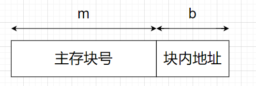

**存储原理：**内存块随机存入Cache中的一行

**查找过程：**逐一对比Cache中的主存块号是否是目标块号

**优点：**Cache利用率高，块冲突概率低

**缺点：**查找速度慢（需要从头到尾遍历Cache）

###### 组相联映射

**Cache结构**

**存储原理：** 将Cache分为Q（$2^q$）组。将主存分区，每个区大小也为Q（$2^q$）。将每个区中的字块放入对应的组当中的任意一行。也就是说。区和组之间采用直接映射，组内采用全相联映射。 

- 组号 = 内存块号 % Cache组数（二进制直接截断后q位）
- 区号 = 内存块号 / Cache组数（向下取整）（二进制直接取前m-q位）

**查找过程：**

1. 计算出目标块的组号
2. 逐一对比组内每一行的区号是否是目标区

**优点：**寻址比全相联映射快，冲突率比直接相联映射低。

------

#### 读写操作

##### 写直达法(Write-Trough)

进行写操作的时候，既写入缓存，又写入主存。保证主存和Cache的数据始终一致，但增加了访问次数。

##### 写回法(Write-Back)

进行写操作的时候，只把数据写入缓存。当Cache中的数据要被替换出去的时候，再写入主存。需要增加一个标志位：是否被修改过。只有被修改过，才需要写入主存。

------

# 计算机的运算方法

## 进制转换

### 任意进制转十进制

$$
\sum _{i=-m}^n K_i*X^i = 
\underbrace{K_n*X^n +\cdots+ K_1*X^1 + K_0*X^0}_{整数部分} + 
\underbrace{K_{-1}*X^{-1} +\cdots+ K_{-m}*X^{-m}}_{小数部分}
$$

例子：
$$
\begin{aligned}
1011.101B  
&= 1*2^3 + 0*2^2 + 1*2^1 + 1*2^0 + 1*2^{-1} + 0*2^{-2} + 1*2^{-3}\\ 
&= 8+0+2+1+0.5+0+0.125\\ 
&= 11.625D
\end{aligned}
$$

### 十进制转任意进制(整数部分) 

$$
\frac {K_n*X^n + K_{n-1}*X^{n-1} + \cdots + K_1*X^1 + K_0*X^0} {X} 
= \underbrace{K_n*X^{n-1} + K_{n-1}*X^{n-2} +\cdots+ K_1*X^0}_商 \ldots \underbrace{K_0}_{余数}
$$

例子：
$$
\begin{aligned}
22D = 10100&B\\ \\
22/2 = 11 \ldots &0\\
11/2 = 5 \ldots &1\\
5/2 = 2 \ldots &1\\
2/2 = 1 \ldots &0\\
1/2 = 0 \ldots &1\\
\end{aligned}
$$

### 十进制转任意进制(小数部分)

$$
\begin{aligned}
&	\{K_{-1}*X^{-1} + K_{-2}*X^{-2} + K_{-3}*X^{-3} + \cdots + K_{-n}*X^{-n}\}*X\\
&=	\underbrace{K_{-1}}_{整数} + 
	\underbrace{K_{-2}*X^{-1} + K_{-3}*X^{-2} + \cdots + K_{-n}*X^{-(n-1)}}_{小数}
\end{aligned}
$$

例子：
$$
&0.3D = 0.0\overline{1001}\ldots B\\
&0.3*2 = 0 + 0.6\\
&0.6*2 = 1 + 0.2\\
&0.2*2 = 0 + 0.4\\
&0.4*2 = 0 +0.8\\
&0.8*2 = 1 + 0.6\\
&0.6*2 = 1 + 0.2\\
&0.2*2 = 0 + 0.4\\
&0.4*2 = 0 +0.8\\
&0.8*2 = 1 + 0.6\\
&\vdots
$$

### 二进制转八进制十六进制

$$
\begin{aligned}
&1011011001B
\\&=\underline{1}\;\underline{011}\;\underline{011}\;\underline{001}B = (1331)_8
\\&=\underline{10}\;\underline{1101}\;\underline{1001}B = (2d9)_{16} = 2d9H 
\end{aligned}
$$

------

## 定点数

### 原码

#### 原码整数定义

$$
[X]_{原整} =
\begin{cases}
\begin{align}
&0,X & 2^n > X \geqslant  0 \\
&2^n-X & 0 \geqslant  X > -2^n \\
\end{align}
\end{cases}
\quad (n=X的位数)
$$

例如：
$$
\begin{align}
&当X = +1100时，[X]_{原整}=0,1100\\
&当X = -1100时，[X]_{原整}=2^4-(-1100) = 10000+1100 = 1,1100
\end{align}
$$

#### 原码小数定义

$$
[X]_{原小} =
\begin{cases}
\begin{align}
&X & 1>X \geqslant  0 \\
&1-X & 0 \geqslant  X> -1 \\
\end{align}
\end{cases}
$$

例如：
$$
\begin{align}
&当X = +0.1101时，[X]_{原小}=0.1101 \\
&当X = -0.1101时，[X]_{原小}=1-(-0.1101) = 1.1101
\end{align}
$$
等比数列求和公式(公比为q): 
$$
\begin{align}
& S_n = a_1 + a_2 + \ldots + a_n \\
& q S_n = a_2 + a_3 + \ldots + a_{n+1} \\
& S_n - q S_n = (1 - q) S_n = a_1 - a_{n+1} \\
& S_n = \frac {a_1 - a_{n+1}} {1 - q} 
= \frac {a_1 - a_1 * q^n} {1 - q} 
= a_1\frac {1 - q^n}{1 - q}
\end{align}
$$
原码整数表示范围（设数值部分有n位，即机器字长为n+1位）：
$$
\begin{align}
\pm\sum_{i=0}^{n-1}2^i &= 2^{0}+2^{1}+ \ldots +2^{n-2}+2^{n-1} \\
&=2^0 \frac {1 - 2^{(n-1)-0+1}} {1-2} \\
&=1 \frac {1 - 2^n} {-1} \\
&= \pm (2^{n} - 1)
\end{align}
$$
原码小数表示范围（设数值部分有n位，即机器字长为n+1位）：
$$
\begin{align}
\pm\sum_{i=-1}^{-n} 2^i & = 2^{-1}+2^{-2}+ \ldots +2^{-n+1}+2^{-n} \\
& =2^{-1} \frac {1-2^{-(n-1+1)}} {1-2^{-1}} \\
& =\frac{1}{2} \frac {1-2^{-n}} {1-\frac{1}{2}} \\
& =\pm(1-2^{-n})
\end{align}
$$
原码的0有+0和-0两种表现形式
$$
整数
\begin{cases}
[+0]_{原整}= 0,000\;0000 \\
[-0]_{原整}= 1,000\;0000 \\
\end{cases}
\quad
小数
\begin{cases}
[+0]_{原小}= 0.000\;0000 \\
[-0]_{原小}= 1.000\;0000 \\
\end{cases}
$$

------

### 反码

#### 原码转反码

若符号位为0（正数），则反码与原码相同
$$
X=15.75D\\
15D
\begin{cases}
[X]_{原整}= 0,000\;1111\\
[X]_{反整}= 0,000\;1111\\
\end{cases}
\qquad
0.75D
\begin{cases}
[X]_{原小}= 0.110\;0000\\
[X]_{反小}= 0.110\;0000\\
\end{cases}
$$

若符号位为1（负数），则数值位全部取反
$$
X=-15.75D\\
-15D
\begin{cases}
[X]_{原整}= 1,000\;1111\\
[X]_{反整}= 1,111\;0000\\
\end{cases}
\qquad
-0.75D
\begin{cases}
[X]_{原小}= 1.111\;0000\\
[X]_{反小}= 1.000\;1111\\
\end{cases}
$$
0的反码
$$
整数
\begin{cases}
[+0]_{原整}= 0,000\;0000 \Rightarrow [+0]_{反整}= 0,000\;0000\\
[-0]_{原整}= 1,000\;0000 \Rightarrow [-0]_{反整}= 1,111\;1111\\
\end{cases}
\quad
小数
\begin{cases}
[+0]_{原小}= 0.000\;0000 \Rightarrow [+0]_{反小}= 0.000\;0000\\
[-0]_{原小}= 1.000\;0000 \Rightarrow [-0]_{反小}= 1.111\;1111\\
\end{cases}
$$

------

### 补码

#### 补码整数定义

$$
[X]_{补整} =
\begin{cases}
\begin{align}
&0,X & 2^n > X \geqslant  0 \\
&2^{n+1}+X & 0 > X \geqslant -2^n & \quad (mod \quad 2^{n+1})\\
\end{align}
\end{cases}
\quad 
$$

例如：
$$
\begin{align}
&当X = +1010时，[X]_{补整}=0,1010\\
&当X = -1101时，[X]_{补整}=2^5+(-1101) = 10\;0000-1101 = 1,0011
\end{align}
$$

#### 补码小数定义

$$
[X]_{补小} =
\begin{cases}
\begin{align}
&X & 1>X \geqslant  0 \\
&2+X & 0 > X \geqslant -1 & \quad(mode 2)\\
\end{align}
\end{cases}
$$

例如：
$$
\begin{align}
&当X = +0.1001时，[X]_{补小}=0.1001 \\
&当X = -0.0110时，[X]_{补小}=2+(-0.0110) = 1.1010
\end{align}
$$

#### 补码的意义

模运算的性质：
$$
设x,m \in Z, m>0则存在唯一决定的整数q和r使得：\\
x = qm + r \quad 0 \leqslant r < qm
$$
例子：
$$
\begin{align}
-3 &\equiv +7 &(mode10) \\
-3 &\equiv +97 &(mode100) \\
-1011 &\equiv +0101 &(mode2^4) \\
-0.1001 &\equiv +1.0111 &(mode2) \\
&\quad \vdots \\
\end{align}
$$
同理：
$$
\begin{align}
-3 &= (-1)*12+9 \\
9 &= 0*12+9 \\
21 &= 1*12+9 \\
33 &= 2*12+9 \\
&\quad \vdots \\
-3 \equiv 9 &\equiv 21 \equiv33 \ldots (mode12)\\
\end{align}
$$
可以看出10+（-3）， 10+（9）， 10+（21）， 10+（33）在（mod 12）的条件下结果相同，所以在（mod m）的条件下， 若能找到负数的补数，就可以用正数的加法来等价代替减法。

#### 原码转补码的原理

$$
\begin{align}
若X为&负整数,例如 X=-1011 \\
[X]_{补整} &= 2^{n+1} + X \\
&= 10\;0000 + X \\
&= 1\;1111 + 0\;0001 + X \\
&= 1\;1111 - x_1 x_2 x_3 x_4 + 0\;0001 \\
&= 1\;\overline x_1 \overline x_2 \overline x_3 \overline x_4 + 0\;0001
\end{align}
$$

#### 原码转补码

若符号位为0（正数），则补码与原码相同
$$
X=15.75D\\
15D
\begin{cases}
[X]_{原整}= 0,000\;1111\\
[X]_{补整}= 0,000\;1111\\
\end{cases}
\qquad
0.75D
\begin{cases}
[X]_{原小}= 0.110\;0000\\
[X]_{补小}= 0.110\;0000\\
\end{cases}
$$
若符号位为1（负数），则补码=反码末位+1
$$
X=-15.75D\\
-15D
\begin{cases}
[X]_{原整}= 1,000\;1111\\
[X]_{反整}= 1,111\;0000\\
[X]_{补整}= 1,111\;0001\\
\end{cases}
\qquad
-0.75D
\begin{cases}
[X]_{原小}= 1.110\;0000\\
[X]_{反小}= 1.001\;1111\\
[X]_{补小}= 1.010\;0000\\
\end{cases}
$$

0的补码
$$
整数
\begin{cases}
[+0]_{原整}= 0,000\;0000 \\
[+0]_{补整}= 0,000\;0000 \\
\\
[-0]_{原整}= 1,000\;0000 \\
[-0]_{反整}= 1,111\;1111 \\
[-0]_{补整}= 0,000\;0000 \\
\\
[+0]_{补整} = [-0]_{补整} = 0,000\; 000
\end{cases}
\qquad
小数
\begin{cases}
[+0]_{原小}= 0.000\;0000 \\
[+0]_{补小}= 0.000\;0000 \\
\\
[-0]_{原小}= 1.000\;0000 \\
[-0]_{反小}= 1.111\;1111 \\
[-0]_{补小}= 0.000\;0000 \\
\\
[+0]_{补小} = [-0]_{补小} = 0.000\; 000
\end{cases}
$$

$$
\begin{align}
&定点整数补码[X]_补整: 1,000\;0000表示-2^{7} \\
&因此若机器字长为n+1位,即数值部分为n位,补码整数表示范围为[-2^{n},2^n-1](比原码多表示一个2^{-n})\\ 
\\
&定点小数补码[X]_补小: 1.000\;0000表示-1\\
&因此若机器字长为n+1位,即数值部分为n位,补码小数表示范围为[-1,1-2^{-n}](比原码多表示一个-1)
\end{align}
$$

------

#### Java中的int类型

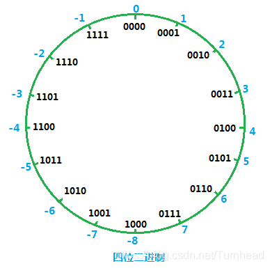

Java中的int类型大小为4个字节，即32位，相当于对所有的数天然mod $2^{32}$，也就是1后面32个0。

java正整数的最大值为: 0x7fff ffff = $2^{31}$-1; 最小值为：0x8000 0000 = $-2^{31}$ 

如上图所示原理，java中 -1 的补码则为 $2^{32}$ - 1 = 0xffff ffff。因为0x8000 0000刚好等于 $2^{32}/2$ 既可以表示 $2^{31}$ 也可以表示 $-2^{31}$ ，为了统一规范，将 0x8000 0000 表示为负数的最小值即$-2^{31}$。

------

### 移码

补码的基础上，将符号位取反。移码和补码一一对应，故表示范围也相同。（**移码只能用于表示整数！**）

移码的本质相当于补码+偏置值。
$$
15D
\begin{cases}
[X]_{原整}= 0,000\;1111\\
[X]_{反整}= 0,000\;1111\\
[X]_{补整}= 0,000\;1111\\
[X]_{移整}= 1,000\;1111\\
\end{cases}
\qquad
-15D
\begin{cases}
[X]_{原整}= 1,000\;1111\\
[X]_{反整}= 1,111\;0000\\
[X]_{补整}= 1,111\;0001\\
[X]_{移整}= 0,111\;0001\\
\end{cases}
\qquad
\begin{align}
&\because[+0]_补 = [-0]_补 = 0000\;0000 \\
&\therefore [+0]_移 = [-0]_移 = 1000\;0000
\end{align}
$$
移码可以很方便的比较数的大小

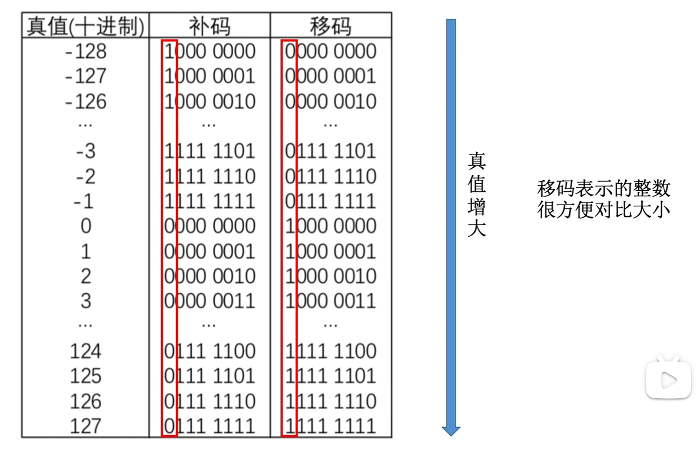

几种码表示定点数，**注意0的次数！**

------

## 移位运算

### 算数移位

| 符号 | $2^6$ | $2^5$ | $2^4$ | $2^3$ | $2^2$ | $2^1$ | $2^0$ |
| ---- | ----- | ----- | ----- | ----- | ----- | ----- | ----- |
| 1    | 0     | 0     | 1     | 0     | 1     | 0     | 0     |

从上表格可以看出，位移会导致每位的权重发生改变。每左移一位，相当于乘2；每右移一位，相当于除2；

**原码**的算数移位：符号位保持不动， 仅对数值部分进行移位，**高/低位补0**。

**反码**的算数移位：符号位保持不动， 仅对数值部分进行移位，正数和原码相同，**负数高/低位补1**。

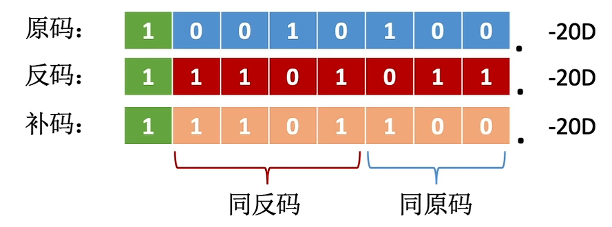

**补码**的算数移位：符号位保持不动， 仅对数值部分进行移位，正数和原码相同，**负数高补1；低位补0**。

### 逻辑位移

**所有码**都是**高/低位补0**。

### 循环位移

------

## 加法运算

设机器字长为8位，首位为符号位，通过补码存储

A = +1111 → $[A]_原$= 0000 1111→ $[A]_补$= 0000 1111

B = -11000 → $[B]_原$ = 1001 1000 → $[B]_补$ = 1110 1000

$[A+B]_补$ = $[A]_补$+$[B]_补$ = 0000 1111 + 1110 1000 = 1111 0111

$[A-B]_补$ = $[A]_补$+$[-B]_补$ = 0000 1111 + 0001 1000 = 0010 01111

$[B-A]_补$ = $[B]_补$+$[-A]_补$ = 1110 1000 + 1111 0001 = 1101 1001

### 溢出判断

有符号数的溢出，只存在于正+正，负+负。正+正溢出到符号位，结果为负。负+负溢出到符号位，结果为正

#### 采用一位符号位

##### 方法一

设A的符号位为$A_s$，B的符号位为$B_s$，运算结果的符号位为$S_s$。

isOverFlow = ($A_s$ & $B_s$ & $\overline S_s$) | ($\overline A_s$ & $\overline B_s$ & $S_s$) 

当AB都是正数且没有溢出: (0 & 0 & 1) | (1 & 1 & 0) = 0|0 = 0。

##### 方法二

设符号位的进位为S，最高数值位的进位为N

上溢：S = 0，N = 1；

下溢：S = 1，N = 0；

isOverFlow = S ^ N

### 采用两位符号位

其实和一位符号位的方法二是一样的

## ==乘法运算==

## ==除法运算==

------

## 浮点数

N = S × $r^j$

阶码：常用补码或者移码表示的整数，阶码反映浮点数的表示范围以及小数点的实际位置。

阶符：表示小数点移动方向

尾数：常用原码或者补码表示的定点小数，尾数反映浮点数的精度，

数符：表示数的正负

例子：

n = 0,01; 1.1001 = $2^1$ × $(1.1001)_补$ = $2^1$ × $(-0.0111)_原$ = -0.111

### 浮点数尾数规格化

规格化浮点数：规定尾数的最高**数值位**必须是一个有效值。这样可以有效利用空间，提高精度。像0.00001这种，前面0完全可以用阶码表示。

#### 左归

例如尾数是0.00101这种情况，需要将尾数算数左移2位变成0.101，同时阶码减2。(小数点前面是符号位)

#### 右归

例如尾数经过运算后是111.01这种情况，需要将尾数右归算数右移3位变成0.11101，同时阶码加3。

### 浮点数标准 IEEE754

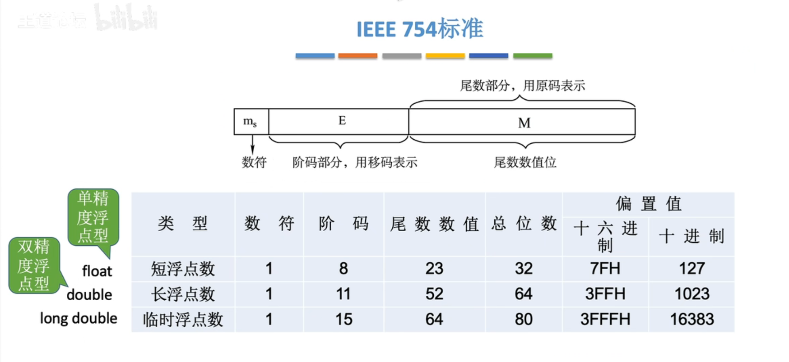

IEE754标准中，阶码采用移码表示

------

# 数据校验

| 信息 | A    | B    | C    | D    |
| ---- | ---- | ---- | ---- | ---- |
| 编码 | 00   | 01   | 10   | 11   |

| 信息 | A    | B    | C    | D    |
| ---- | ---- | ---- | ---- | ---- |
| 编码 | 100  | 001  | 010  | 111  |

码字：由若干位组成的一个字，例如A可以表示为00或者100

两个码字之间的距离：两个码字之间具有不同位的个数，例如表1中 A：00 和 B：01 的距离为1

码距：一组编码方案中，任意两个码字的最短距离，例如表一码距为1，表二为2

## 奇偶校验码

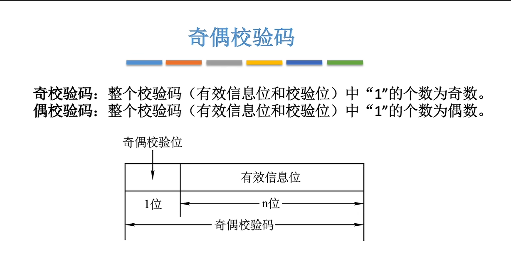

例子：

奇校验：$\underline 1111 \ 1110$  	$\underline 0111 \ 1111$  

偶校验：$\underline 1111 \ 1111$  	$\underline 0111 \ 1110$  

### 偶校验实现

求偶校验位的硬件实现：对各个bit位进行异或（相同为0，不同为1）运算，得到的结果为偶校验位。

例子：

$\underline \;111 \ 1111 \rightarrow$ 1^1^ 1^1^ 1^1^ 1 = 0^0^0^1 = 0^1 = 1

$\underline \;111 \ 1110 \rightarrow$ 1^1^ 1^1^ 1^1^ 0 = 0^0^0^0 = 1^1 = 0

如何偶校验：对各个bit位进行异或，若结果为1则证明出错。

## ==Hamming Code==

若一个数据的信息位为n位，校验位为k位，一共为n+k位

k个校验位能表示$2^k$种状态，hamming code 默认一串数据只错一位，固 $2^k \geqslant (n+k)_位+1_{正确状态}$ 

## ==循环冗余校验码(Cyclic Redundancy Check CLC)==

------

# 数据编码

## BCD码

### 8421码

每一位二值代码的“1”都代表一个固定数值。将每位“1”所代表的十进制数加起来就可以得到它所代表的十进制数码。因为代码中从左至右看每一位“1”分别代表数字“8”“4”“2”“1”，故得名8421码。其中每一位“1”代表的十进制数称为这一位的权。因为每位的权都是固定不变的，所以8421码是恒权码。

| 0    | 1    | 2    | 3    | 4    | 5    | 6    | 7    | 8    | 9    |
| ---- | ---- | ---- | ---- | ---- | ---- | ---- | ---- | ---- | ---- |
| 0000 | 0001 | 0010 | 0011 | 0100 | 0101 | 0110 | 0111 | 1000 | 1001 |

例子：32.78D = 0011 0010 . 0111 1000

### 余3码

8421码 + 3  

### 2421码

每一位二值代码的“1”都代表一个固定数值。将每位“1”所代表的十进制数加起来就可以得到它所代表的十进制数码。因为代码中从左至右看每一位“1”分别代表数字“2”“4”“2”“1”，故得名2421码。其中每一位“1”代表的十进制数称为这一位的权。因为每位的权都是固定不变的，所以2421码是恒权码。

为防止歧义出现例如“5“既可以采用0101也可以采用1011表示，所有≥5的数，首位都为1。

| 0    | 1    | 2    | 3    | 4    | 5    | 6    | 7    | 8    | 9    |
| ---- | ---- | ---- | ---- | ---- | ---- | ---- | ---- | ---- | ---- |
| 0000 | 0001 | 0010 | 0011 | 0100 | 1011 | 1100 | 1101 | 1110 | 1111 |
